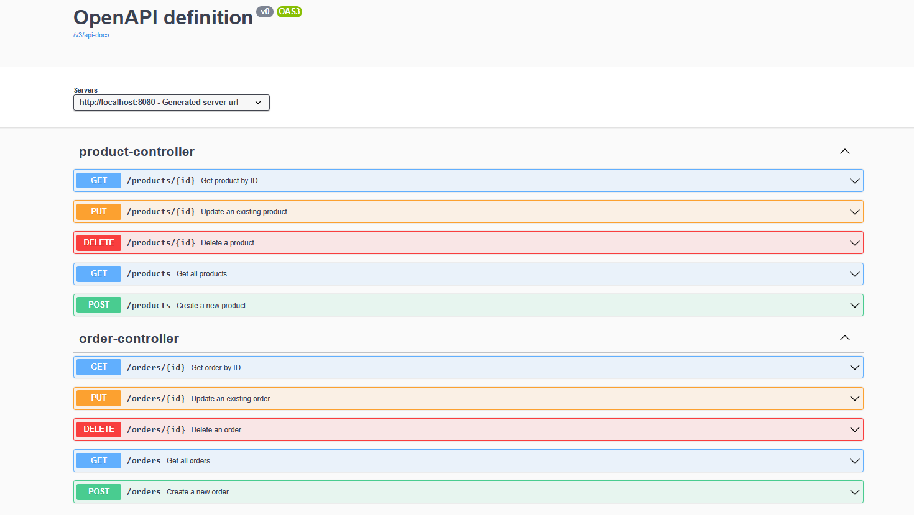
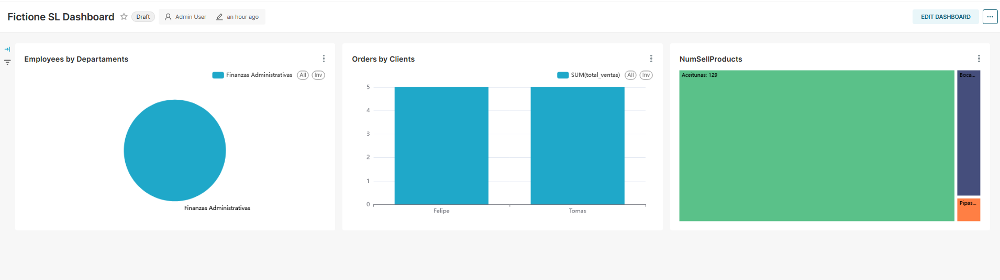

## Fictione SL - Backend API

Este proyecto es el backend de Fictione SL, un sistema de gestión de empleados, productos, clientes 
y pedidos. Está construido con Spring Boot 3, JPA/Hibernate, PostgreSQL 
y documentación automática con Swagger/OpenAPI, junto a un servicio de Superset para poder realizar BI.


### Como lanzar el proyecto

Solo tienes que compilar el proyecto con
``` ./gradlew clean build -x test``` y luego poner ```docker compose up```

Ya se lanzara el proyecto

### Tecnologías utilizadas

- Java 21
- Spring Boot 3

  - Web

  - Data JPA

  - Security

- PostgreSQL
- MapStruct (mapeo DTO ↔ Entity)
- Lombok
- Springdoc OpenAPI (Swagger)
- Superset para BI

### Swagger / OpenAPI

Una vez que el backend está en ejecución, puedes ver la documentación interactiva en:
```bash
http://localhost:8080/swagger-ui/index.html
```



### Superset

Para poder acceder a Superset hay que acceder a este enlace:
```bash
http://localhost:8088
```

Las credenciales base son, user -> admin password -> admin, puedes cambiarlas en el 
```docker-compose.yml```

